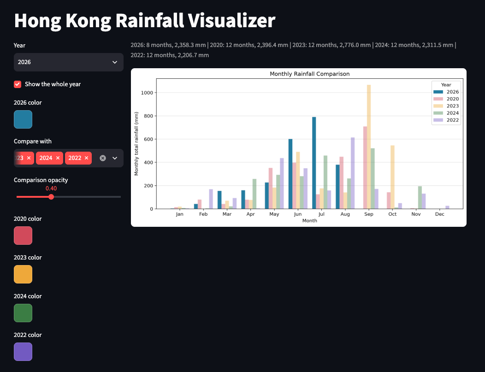

# Hong Kong Rainfall Visualizer
## The phenomenon
This visualizes the Hong Kong rainfall record to a graph. It provided two time frame mode - viewing the whole year and compare with other years, or every single day in a month.  
It is useful for us to easily check the rainfall record and compare it between different years immediately and predict the possibility of raining in the future. 



## The source
I fetch my data from the Hong Kong Observatory: [https://www.hko.gov.hk/tc/cis/dailyElement.htm?ele=RF&y=2026](https://www.hko.gov.hk/tc/cis/dailyElement.htm?ele=RF&y=2026)  
It provides various of data include but not limit to: rainfall, temperature, or pressure, etc.  
For program easier access, it can direct calling web request 
```https://www.hko.gov.hk/cis/individual_day/daily_{year}.xml```  
Filling the {year} with the target year, to get the source data that shown on this page. It will get every single element data, every day, and follow with 12 data, which represent 12 months in the whole year, and stored as .xml. In our case just Rainfall(RF) is used and measured with (mm).
## What the picture shows

<!-- Two or three sentences. Including what it hides: every transformation throws
something away, and naming what yours threw away is the easiest way to sound like
you know what you did. -->


## Run it
To generate a single year or a single month rainfall data. Use:
```
uv run plot.py
```
Enter a year and month when prompted. Generated image will store in `out/`.


To use the browser interface instead, run:

```
uv run --with streamlit --with matplotlib --with requests streamlit run streamlit_app.py
```
Then run [http://localhost:8501](http://localhost:8501)  
In whole-year mode, use **Compare with** to add up to four other years. Each
comparison year has an adjustable color, and the shared opacity control. The primary year color is also adjustable.  
To display a single month, uncheck the **Show the whole year** to switch to single month mode.
